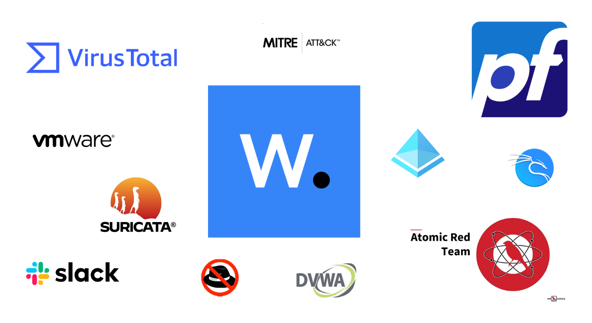
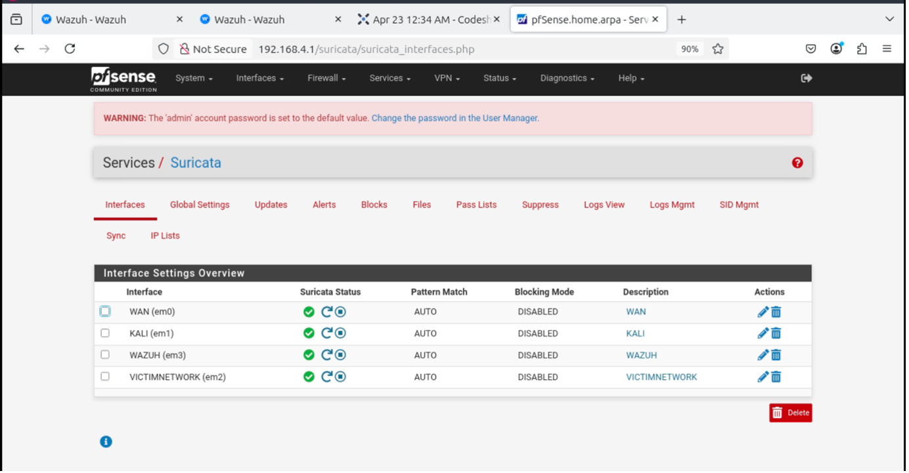

# SOC Lab with Real-Time Threat Monitoring

This repo is the **full deep dive** into my SOC Homelab project where I built a **mini Security Operations Center** using open-source tools like Wazuh, Suricata, pfSense, and more... all from scratch.  
Oh, and yes — **custom rules, Sysmon logs, MITRE ATT&CK mappings, and Atomic Red Team tests** are all here! 💣💻

---
## 🔧 What’s Inside the report?
- 📄 Full Detailed Report of the Project  
- ⚙️ Wazuh Server Configuration Files  
- 🛠️ Custom Detection Rules mapped to MITRE ATT&CK IDs  
- 🧪 Atomic Red Team Simulations & Detection Validation  
- 💬 Slack Alert Integrations for Real-Time Monitoring  
- 🧠 Lessons learned, human errors, and tuning adventures

---

## 🚀 Why You Should Check This Out
Whether you're a **cybersecurity student**, a **SOC analyst in training**, or just a curious hacker soul 🌐 — this homelab setup gives you everything to start detecting like a pro.

---

## 👀 Connect with Me
🔗 Portfolio: [yogeshrathod.framer.website](https://www.yogeshrathod.framer.website)  
💼 LinkedIn: [linkedin.com/in/yogeshrathod](https://www.linkedin.com/in/yrathod/)  
Feel free to connect or shoot any questions my way. I love nerdy convos. 😎  

---

## 💡 Fun Fact
This whole lab was built on a **refurb laptop + tea-fueled weekends = 💥 production-grade detection magic**!

---

> “Logs don’t lie — you just need to know where to look.”  
## Abstract

This project presents the design, implementation, and evaluation of a SOC homelab capable of real-time cyber threat detection and incident response. The lab utilizes open-source tools including:

- Wazuh for SIEM
- Suricata for network intrusion detection
- pfSense for firewall management
- Atomic Red Team tests 
- Integration of VirusTotal and Abuse IP DB
- Slack configuration in wazuh for notification of alerts

Key features:
- Simulates attack scenarios (brute-force attacks, malware infections, file integrity violations)
- Implements MITRE ATT&CK techniques
- Integrates real-time Slack alerting
- Managed using Jira for project tracking

## Table of Contents

- [Hardware Requirements](#hardware-requirements)
- [Simulated Attack Scenarios - Wazuh POC](#simulated-attack-scenarios)
- [Integrating Atomic Red Team with Wazuh](#configured-attack-emulations-using-mitre-attck-framework-and-atomic-red-team-tests)
- [Real-Time Alerting with Slack WebHook](#real-time-alerting-with-slack)
- [Conclusion](#conclusion)
- [Future Work](#future-work)

## Hardware Requirements

| Component           | Memory (RAM) | Storage |
|---------------------|--------------|---------|
| Wazuh SIEM VM       | 12 GB        | 50+ GB  |
| PfSense Firewall VM | 4 GB         | 20 GB   |
| Windows Server VM   | 8 GB         | 10 GB   |
| Windows Client VM   | 4 GB         | 10 GB   |
| Kali Linux VM       | 4 GB         | 10 GB   |

## SOC Homelab Architecture

### Core Components
- **Host System**: Windows machine running VMware Workstation Pro 17 (Free License)
- **pfSense Firewall**: Central gateway for all network traffic
- **Segmented Networks**:
  - `VMnet2`: Kali Linux attack machine (192.168.1.2)
  - `VMnet3`: Domain Controller + Victim machines
  - `VMnet4`: Wazuh SIEM server (192.168.4.1)

### Core Components

#### SIEM (Wazuh)

#### IDS (Suricata)

#### Firewall (pfSense)

#### Network Architecture

### Configuration Steps

1. **pfSense Setup**:
   - Interface configuration
   - NAT and IP forwarding
   - Syslog integration with Wazuh

2. **Wazuh Installation**:
   - Server setup
   - Agent deployment

## Simulated Attack Scenarios

- **Firewall Access Blocking:** Created detection rules to block attacker access via firewall.

- **File Integrity Monitoring (FIM)**: Implemented FIM to detect unauthorized changes in critical files.

- **RDP Brute-force and SQL Injection Protection:** Developed detection mechanisms for SSH/RDP brute-force attacks and SQL Injection attacks.

- **MITRE ATT&CK Tactics:** Executed Atomic Red Team tests on Windows endpoints, extracted relevant logs using Sysmon, forwarded them to Wazuh, and developed detection rules mapped to specific ATT&CK technique IDs for accurate threat identification.

- **Malicious Commands:** Detection rules for Linux endpoints. 

- **Alerting & Notifications:** Set up alerting system with notifications directly to Slack for real-time threat updates.

## Configured Attack Emulations Using MITRE ATT&CK Framework and Atomic Red Team Tests

| Technique | Description 
|-----------|-------------
| T1053 | Scheduled Task/Job 
| T1218.010 | Regsvr32 Execution 
| T1518.001 | Security Software Discovery 
| T1548.003 | Windows Service Modification
| T1123 | Audio Capture

## Real-Time Alerting with Slack

## Conclusion

This project successfully implemented a functional SOC homelab with:
- Real-time threat detection
- Comprehensive monitoring
- Automated response capabilities
- MITRE ATT&CK emulation
- Effective alerting mechanisms

## Future Work

Planned enhancements:
- Suricata NIDS fine-tuning
- Automated incident response playbooks
- Expanded MITRE ATT&CK coverage

## Acknowledgements

Special thanks to:
- [Dayspring Johnson](https://www.linkedin.com/in/dayspringjohnson/)
- [Steven Rocks](https://www.linkedin.com/company/mydfir/about/)

## References

1. [CyberWox SOC Homelab](https://www.youtube.com/playlist?list=PLDqMNdDvMsRkmtiKcZwbhOz7MeLQE0r3G)
2. [MyDFIR Projects](https://www.youtube.com/playlist?list=PLG6KGSNK4PuBWmX9NykU0wnWamjxdKhDJ)
3. [pfSense-Wazuh Integration](https://benheater.com/integrating-pfsense-with-wazuh/)